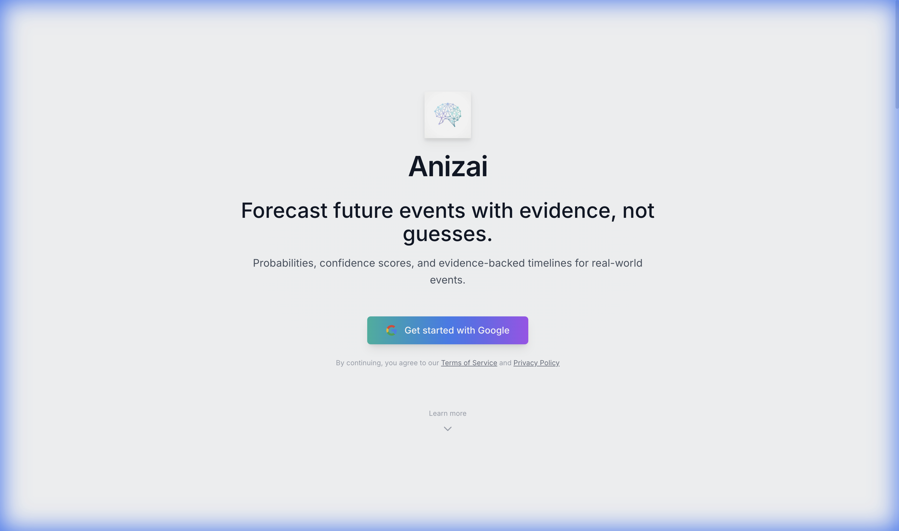
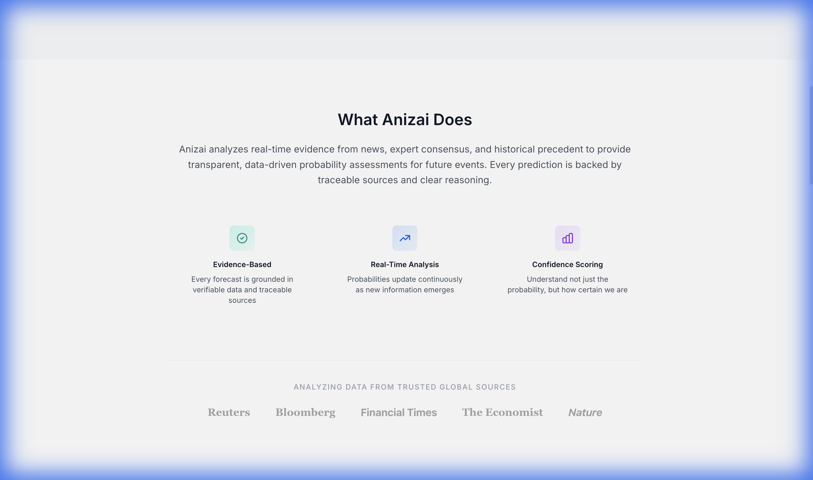
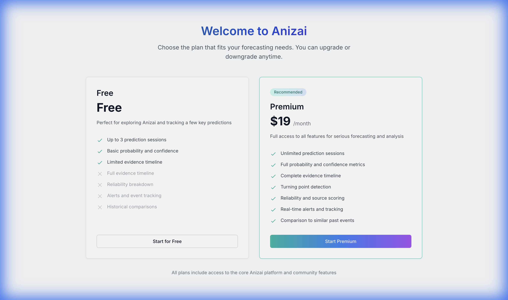
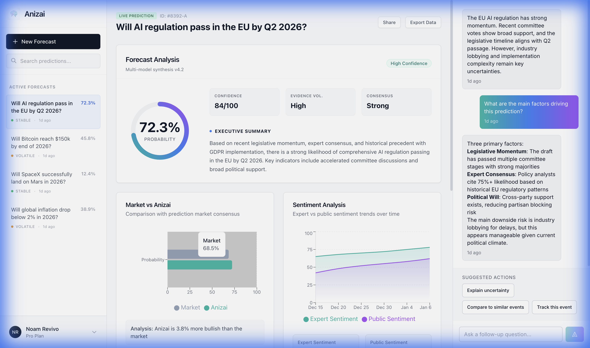
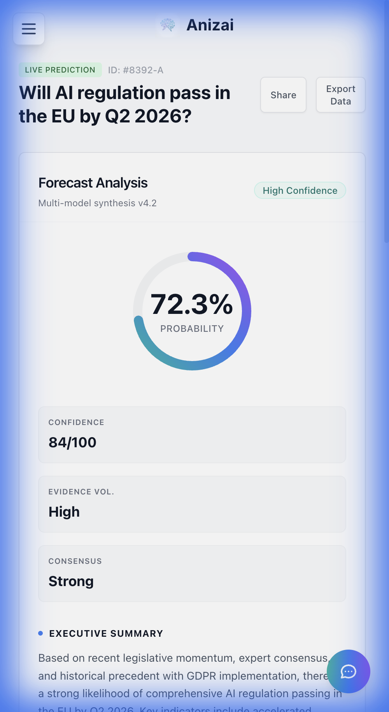

# Anizai

AI-powered forecasting platform with a React client, an Express API, and an experimental data pipeline for event/news ingestion.



## Overview

Anizai is organized as a monorepo with three main parts:

- `client/`: React + TypeScript web app (dashboard, sessions, trending, auth flows)
- `server/`: Express + TypeScript backend API with Firebase-authenticated endpoints
- `data-pipeline/`: Python ingestion and streaming infrastructure (Kafka-first, Spark/Delta planned)

## Tech Stack

### Client

- React 19
- TypeScript
- Vite
- Tailwind CSS
- Firebase Web SDK
- Recharts

### Server

- Node.js (>= 20)
- TypeScript
- Express
- Firebase Admin SDK
- Zod
- Pino
- Vitest

### Data Pipeline

- Python
- Kafka (`kafka-python`)
- Spark + Delta (`pyspark`, `delta-spark`)
- OpenAI + LangChain
- ChromaDB

## Repository Structure

```text
.
├── client/            # Frontend (Vite + React + TS)
├── server/            # Backend API (Express + TS)
├── data-pipeline/     # Ingestion/streaming pipeline (Python)
├── docs/images/       # README and product images
└── README.md
```

## Prerequisites

- Node.js 20+
- npm
- Python 3.10+ (for `data-pipeline`)
- Docker + Docker Compose (optional, for Kafka infra)

## Setup

Required Firebase console steps (one-time, per Firebase project):

1. **Authentication → Sign-in method**: enable **Email/Password** and **Google** providers.
2. **Firestore Database**: create a Firestore instance and deploy the rules from `server/firebase/firestore.rules`.
3. From the Firebase console (Project settings → General → Your apps → Web app), copy the SDK config values into the env files below.

Local environment files (never committed; use the `.env.example` files as templates):

```bash
cp client/.env.example client/.env   # fill VITE_FIREBASE_* and VITE_API_BASE_URL
cp server/.env.example server/.env   # fill FIREBASE_PROJECT_ID
```

Then follow the Quick Start below.

## Quick Start

### 1. Clone

```bash
git clone <your-repo-url>
cd Anizai
```

### 2. Client Setup

```bash
cd client
npm install
cp .env.example .env
npm run dev
```

Client runs at `http://localhost:5173`.

### 3. Server Setup

In a new terminal:

```bash
cd server
npm install
cp .env.example .env
npm run dev
```

Server runs at `http://localhost:3000`.

## Environment Variables

### Client (`client/.env`)

Copy from `client/.env.example`:

- `VITE_FIREBASE_API_KEY`
- `VITE_FIREBASE_AUTH_DOMAIN`
- `VITE_FIREBASE_PROJECT_ID`
- `VITE_FIREBASE_STORAGE_BUCKET`
- `VITE_FIREBASE_MESSAGING_SENDER_ID`
- `VITE_FIREBASE_APP_ID`
- `VITE_API_BASE_URL` (default: `/api`)

### Server (`server/.env`)

Copy from `server/.env.example`:

- `PORT` (default: `3000`)
- `NODE_ENV` (`development`, `production`, `test`)
- `FIREBASE_PROJECT_ID`
- Optional emulator vars:
  - `FIREBASE_AUTH_EMULATOR_HOST`
  - `FIRESTORE_EMULATOR_HOST`

## API Endpoints (Current)

Public:

- `GET /`
- `GET /health`
- `GET /trending`

Protected (Firebase ID token required):

- `GET /me`
- `PATCH /me/plan`
- `GET /sessions`
- `GET /sessions/:id`
- `POST /sessions`
- `POST /sessions/:id/messages`
- `DELETE /sessions/:id`

## Development Commands

### Client

```bash
cd client
npm run dev
npm run build
npm run lint
npm run preview
```

### Server

```bash
cd server
npm run dev
npm run build
npm start
npm run lint
npm run test
```

Emulator helpers:

```bash
cd server
npm run dev:emu
npm run emu:token
npm run emu:test:me
npm run test:session-result
```

## Data Pipeline (Experimental)

Install dependencies:

```bash
cd data-pipeline
python -m venv .venv
source .venv/bin/activate
pip install -r requirements.txt
```

Start Kafka infrastructure:

```bash
cd data-pipeline/infrastructure
docker compose up -d
```

Run the news producer:

```bash
cd data-pipeline
python ingestion/news_producer.py
```

## One-time: migrate legacy demo-user data

The original frontend signed every login in as a hardcoded `demo-user-001`. After real auth was restored, any sessions seeded under that UID become invisible to real users (server enforces ownership). The `migrate:demo-data` script reassigns ownership of every demo-owned Firestore document to a real Firebase Auth user.

It is **dry-run by default**. Always run without `--apply` first and inspect the report.

```bash
cd server

# Option A — create a fresh Firebase Auth user as part of the migration:
npm run migrate:demo-data -- --email=viewer@anizai.local --password=<pwd>           # dry-run
npm run migrate:demo-data -- --email=viewer@anizai.local --password=<pwd> --apply   # commit

# Option B — migrate to a UID you already created (e.g. via Google sign-in in the UI):
npm run migrate:demo-data -- --target-uid=<existingUid>            # dry-run
npm run migrate:demo-data -- --target-uid=<existingUid> --apply    # commit

# Override the source UID if it differs from the default `demo-user-001`:
npm run migrate:demo-data -- --target-uid=... --demo-uid=<otherUid> --apply
```

The script:
- Updates `userId` in `sessions`, `sessionResults`, `forecastQueries`, and `sessions/*/messages` (the only collections with that field).
- Leaves `users/demo-user-001` and the legacy demo Auth user in place in case other artifacts still reference them.
- Is idempotent — re-running on already-migrated docs is a no-op.

This is a one-time operation tied to the legacy seed data; remove it once it has run successfully against every environment that needs it.

## Screenshots






## Status

Current repository includes an active frontend, backend, and early-stage ingestion pipeline. Some pipeline/orchestration components are scaffolded and still under active development.

## License

MIT
