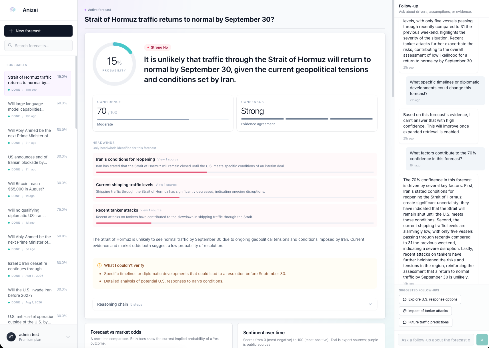
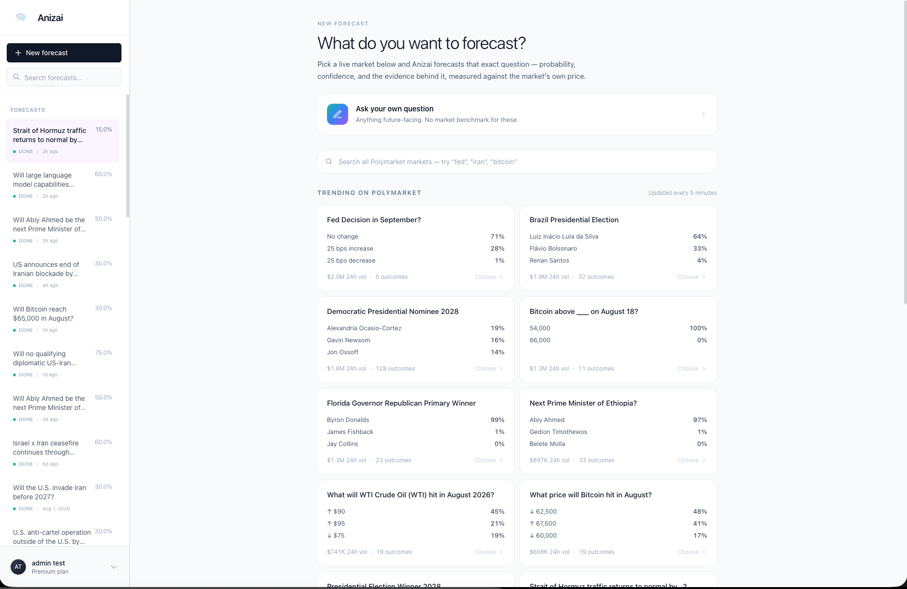
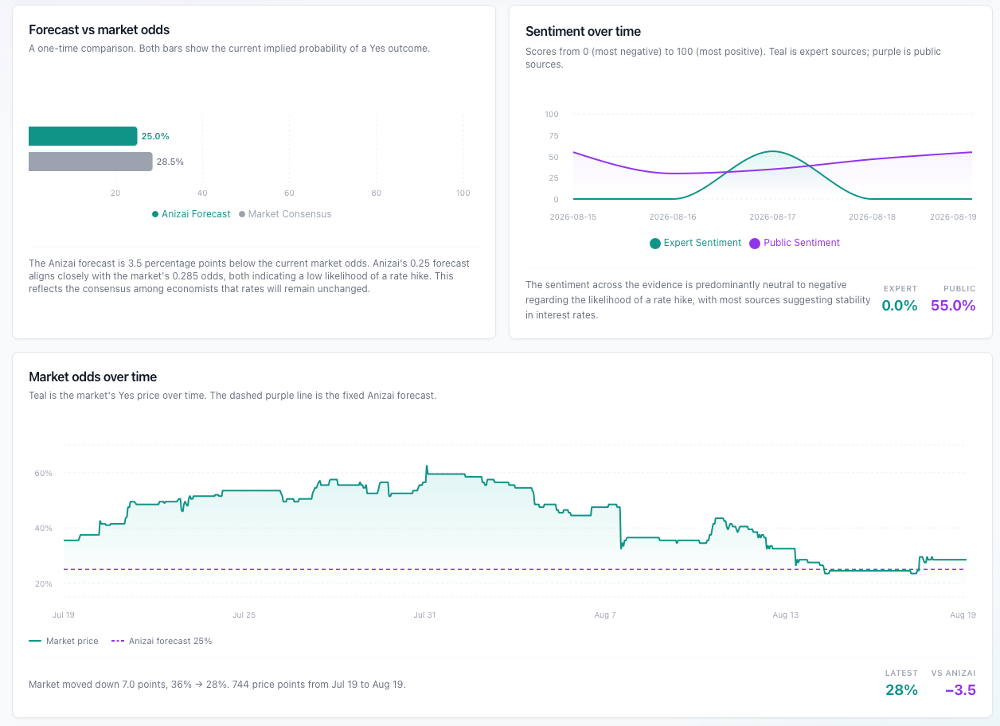
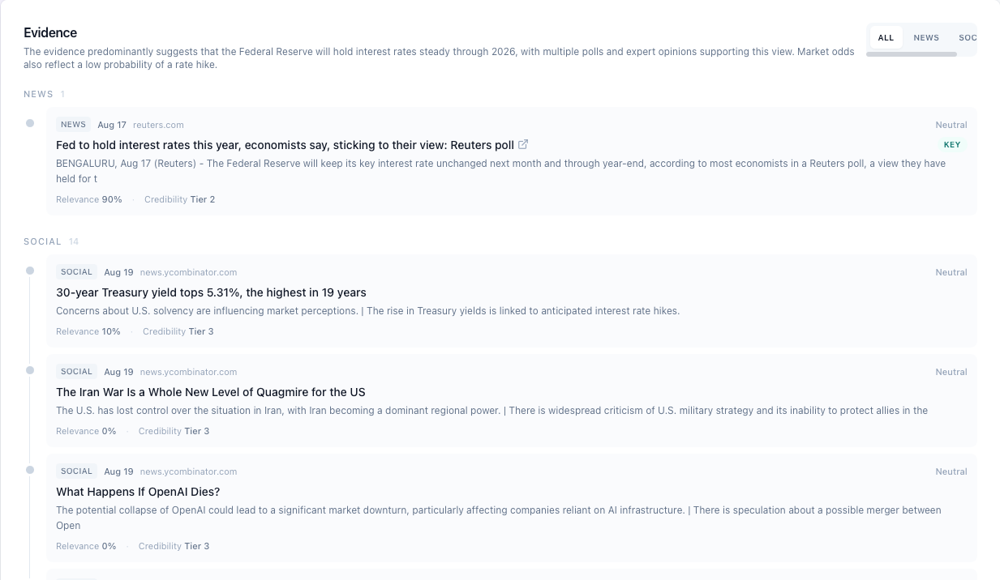
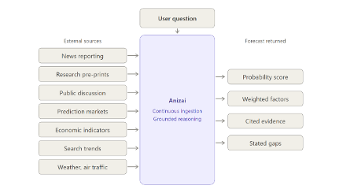
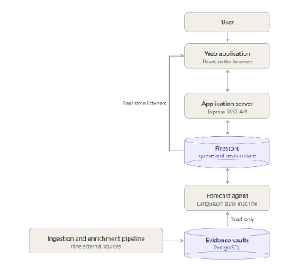
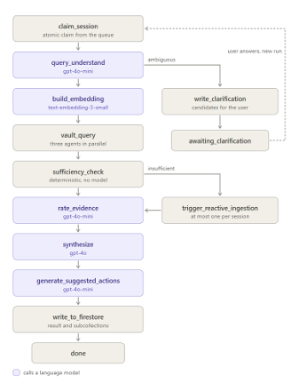
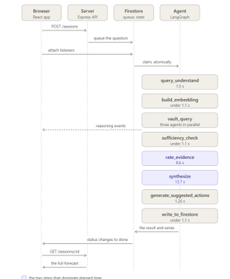
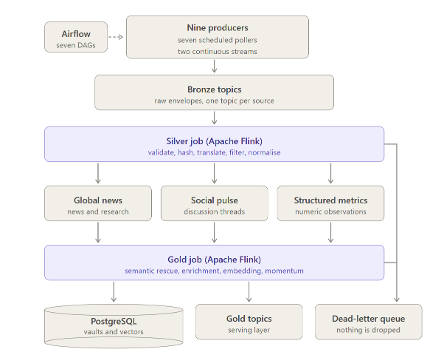
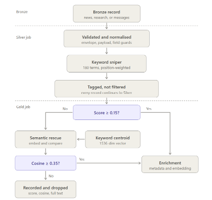

# Anizai

Anizai is an intelligent RAG-based forecasting platform for context-aware event
prediction. A user asks a future-facing question, or selects a live prediction-market
question, and receives a structured forecast with probability, confidence, cited
evidence, weighted drivers and headwinds, transparent reasoning, and follow-up analysis.

The project combines a React product surface, an Express BFF, Firestore queue/state
documents, a LangGraph forecasting agent, and a Kafka/Flink medallion data pipeline
backed by PostgreSQL, pgvector, and TimescaleDB.



## Product

Anizai is built for questions where a bare probability is not enough. Prediction markets
can tell a user what the crowd price is, and search engines can return documents, but
neither explains how fresh evidence, public discussion, structured indicators, and market
movement should be interpreted together.

The product flow has two entry points:

- **Market-backed forecasts**: the user chooses a live Polymarket event or outcome. The
  result can compare Anizai's forecast against the market's own implied probability.
- **Freeform forecasts**: the user asks any future-facing question. The system still
  returns a structured forecast, but without a market benchmark when no matching market
  exists.



Each completed forecast is presented as a decision-oriented workspace:

- Final probability and confidence.
- Verdict language suitable for fast interpretation.
- Key drivers and headwinds, weighted by impact.
- Cited evidence and source traceability.
- Known gaps: what the system could not verify.
- Reasoning chain and follow-up chat over the completed forecast.
- Market odds, sentiment, and price-history surfaces where supporting data exists.

The dashboard also exposes the quantitative context behind a forecast: market consensus,
price movement over time, and sentiment split by evidence source family.



Evidence is kept visible instead of being hidden behind the final answer. The user can
inspect source type, publication date, domain, relevance, credibility tier, and whether a
piece of evidence was marked as key support for the forecast.



## System Context

At the highest level, Anizai continuously ingests external information, grounds a user
question in that evidence base, and returns a forecast that is explicit about its
probability, evidence, and uncertainty.



## Architecture

The repository is organized as a monorepo with five main parts:

| Area | Role |
|---|---|
| `client/` | React + TypeScript SPA: landing page, authentication, forecast creation, dashboard, follow-up chat, settings. |
| `server/` | Express + TypeScript BFF: Firebase auth, session CRUD, idempotency, usage accounting, Firestore reads/writes. |
| `data-pipeline/` | Python data platform: ingestion producers, Kafka topics, Flink Silver/Gold jobs, PostgreSQL vault persistence, LangGraph agent. |
| `calibration/` | Standalone harness that evaluates whether forecast probabilities are calibrated against resolved Polymarket outcomes. |
| `docs/` | Frontend/BFF docs, cross-domain specs, historical audits, and product/architecture images. |

The BFF is deliberately not the reasoning layer. It authenticates the user, creates a
session, writes a queue document, and reads the result back from Firestore. The agent
claims work asynchronously, queries the evidence vaults read-only, and writes the final
forecast back to the session collections.



### Client and BFF

The user-facing product is a Vite + React SPA with a small Express BFF in front of
Firestore. The client uses two read paths:

- **REST pull path** for full aggregates such as sessions, messages, evidence, results,
  market series, and trending markets.
- **Firestore listener path** for low-latency session status, messages, and agent events
  while a forecast is running.

The BFF does not call OpenAI, does not query pgvector, and does not generate forecasts.
Its boundary is authentication, authorization, session lifecycle rules, idempotency, plan
limits, and Firestore mediation.

Key docs:

- [Frontend/BFF overview](docs/C_frontend/frontend_overview.md)
- [Frontend API contract](docs/C_frontend/frontend_api.md)
- [Frontend UI map](docs/C_frontend/frontend_ui.md)

### Forecast Agent

The forecasting engine is a LangGraph state machine. It claims pending Firestore queue
documents, understands the question, embeds it, retrieves evidence from three specialist
retrieval agents, checks evidence sufficiency, rates the evidence, synthesizes the final
forecast, generates suggested follow-ups, and persists the result.



The graph is intentionally split into small nodes so that classification, retrieval,
evidence scoring, final synthesis, and persistence can be tested and monitored
independently. Retrieval agents are deterministic functions, not autonomous chat agents:

- **Researcher** reads `knowledge_vectors` and `knowledge_vault`.
- **Pulse Analyst** reads `social_vectors` and `social_vault`.
- **Market Bridge** reads `momentum_vault` and `mapping_dict`.

Every vault access is read-only from the agent's perspective. Final product writes go
to Firestore under the user's session.



Key docs:

- [Agentic Hub overview](data-pipeline/docs/B_hub/hub_overview.md)
- [Agent state machine and contracts](data-pipeline/docs/B_hub/hub_agents.md)

### Data Pipeline

The data platform is the evidence foundation for the agent. It ingests nine source
families into Kafka, refines them through Bronze, Silver, and Gold layers using Flink,
and persists high-signal documents, social discussion, vectors, and structured metrics
into PostgreSQL.



Current source families include prediction markets, Telegram, Hacker News, NewsAPI,
ArXiv, FRED, Google Trends, OpenWeather, and OpenSky. Airflow runs scheduled producers;
standalone streamers handle continuously updated sources; Kafka decouples producers,
Flink jobs, persistence, and reactive triggers.

The pipeline uses a two-stage relevance filter so the vaults stay focused:

1. A deterministic keyword sniper scores records cheaply.
2. A semantic rescue pass embeds borderline records and promotes conceptually relevant
   items that the keyword pass missed.



Key docs:

- [Pipeline overview](data-pipeline/docs/A_pipeline/pipeline_overview.md)
- [Pipeline processing](data-pipeline/docs/A_pipeline/pipeline_processing.md)
- [Pipeline storage](data-pipeline/docs/A_pipeline/pipeline_storage.md)
- [Pipeline sources](data-pipeline/docs/A_pipeline/pipeline_sources.md)

### Calibration

The calibration harness is separate from production code. It submits real Polymarket
questions through the same Firestore queue used by the product, waits for outcomes to
settle, and computes scoring metrics such as Brier score and calibration curves.

This gives the project a quantitative feedback loop: a forecast labeled 70% should
resolve positively roughly 70% of the time across a large enough cohort.

Key docs:

- [Calibration overview](calibration/README.md)
- [Calibration plan](calibration/docs/calibration_plan.md)
- [Calibration operator runbook](calibration/docs/OPERATOR_RUNBOOK.md)

## Technology Stack

| Layer | Technologies |
|---|---|
| Client | React 19, TypeScript, Vite, Tailwind CSS, Firebase Web SDK, Recharts, lucide-react |
| BFF | Node.js 20+, Express, TypeScript, Firebase Admin SDK, Zod, Pino, Vitest |
| Agent | Python, LangGraph, OpenAI GPT-4o / GPT-4o-mini, `text-embedding-3-small`, Firestore worker |
| Pipeline | Kafka, Apache Flink / PyFlink, Airflow, PostgreSQL, pgvector, TimescaleDB |
| Calibration | Python, FastAPI operator API, PostgreSQL, Vite + React dashboard, pytest |
| Cloud / Ops | Docker, Kubernetes manifests, Prometheus, Grafana, structured JSON logging |

## Repository Structure

```text
.
├── client/                  # Frontend product (Vite + React + TypeScript)
├── server/                  # Express BFF and Firebase rules
│   ├── firebase/            # Firestore rules, indexes, Firebase config
│   ├── scripts/             # Seed, probe, emulator, migration helpers
│   └── tests/               # Vitest suites
├── data-pipeline/           # Ingestion, Flink jobs, persistence, LangGraph agent
│   ├── agent/               # Forecast and follow-up LangGraph workers
│   ├── ingestion/           # Source producers
│   ├── processing/          # Silver/Gold jobs, filtering, enrichment
│   ├── persistence/         # PostgreSQL vault writers/readers
│   ├── infrastructure/      # Docker, Kubernetes, Prometheus, Grafana
│   └── docs/                # Pipeline, hub, and cloud documentation
├── calibration/             # Standalone forecast calibration harness
├── docs/                    # Product docs, BFF docs, specs, images, archives
└── README.md
```

## Quick Start

### Prerequisites

- Node.js 20+
- npm
- Python 3.10+ for `data-pipeline/`
- Docker + Docker Compose for local Kafka/Flink infrastructure
- Firebase project with Authentication and Firestore enabled

### Firebase Setup

One-time Firebase console steps:

1. Enable **Email/Password** and **Google** sign-in providers.
2. Create a Firestore database.
3. Deploy rules from `server/firebase/firestore.rules`.
4. Copy Firebase web config values into `client/.env`.

Environment templates:

```bash
cp client/.env.example client/.env
cp server/.env.example server/.env
```

### Run the Client

```bash
cd client
npm install
npm run dev
```

The client runs at `http://localhost:5173`.

### Run the BFF

```bash
cd server
npm install
npm run dev
```

The server runs at `http://localhost:3000`.

### Run Local Pipeline Infrastructure

```bash
cd data-pipeline/infrastructure
docker compose up -d
```

Install pipeline dependencies:

```bash
cd data-pipeline
python -m venv .venv
source .venv/bin/activate
pip install -r requirements.txt
```

Run a producer:

```bash
python ingestion/newsapi_producer.py
```

## Environment Variables

Client variables, copied from `client/.env.example`:

- `VITE_FIREBASE_API_KEY`
- `VITE_FIREBASE_AUTH_DOMAIN`
- `VITE_FIREBASE_PROJECT_ID`
- `VITE_FIREBASE_STORAGE_BUCKET`
- `VITE_FIREBASE_MESSAGING_SENDER_ID`
- `VITE_FIREBASE_APP_ID`
- `VITE_API_BASE_URL`

Server variables, copied from `server/.env.example`:

- `PORT`
- `NODE_ENV`
- `FIREBASE_PROJECT_ID`
- `ALLOW_DEMO_ROUTES`
- `FIREBASE_AUTH_EMULATOR_HOST`
- `FIRESTORE_EMULATOR_HOST`

The pipeline, agent, and calibration harness each have their own environment contracts
documented in their local `.env.example`, config, or runbook files.

## API Surface

Routes are mounted at the server root. In development, the Vite client prefixes
requests with `/api` and the dev proxy rewrites them to the BFF.

Public:

- `GET /`
- `GET /health`
- `GET /trending`
- `GET /trending/search`

Protected by Firebase ID token:

- `GET /me`
- `PATCH /me/plan`
- `GET /sessions`
- `GET /sessions/:id`
- `POST /sessions`
- `POST /sessions/:id/messages`
- `POST /sessions/:id/clarify`
- `POST /sessions/:id/retry`
- `DELETE /sessions/:id`

Development-only demo routes are double-gated by `ALLOW_DEMO_ROUTES=true` and
`NODE_ENV=development`.

Full route details live in [frontend_api.md](docs/C_frontend/frontend_api.md).

## Development Commands

Client:

```bash
cd client
npm run dev
npm run build
npm run test
npm run lint
npm run preview
```

Server:

```bash
cd server
npm run dev
npm run build
npm start
npm run lint
npm run test
```

Calibration:

```bash
cd calibration
pytest
```

## Documentation Map

| Topic | Start here |
|---|---|
| Product UI and BFF | [docs/C_frontend/frontend_overview.md](docs/C_frontend/frontend_overview.md) |
| REST and Firestore contracts | [docs/C_frontend/frontend_contracts.md](docs/C_frontend/frontend_contracts.md) |
| Screens and dashboard composition | [docs/C_frontend/frontend_ui.md](docs/C_frontend/frontend_ui.md) |
| Data pipeline | [data-pipeline/docs/A_pipeline/pipeline_overview.md](data-pipeline/docs/A_pipeline/pipeline_overview.md) |
| Agentic Hub | [data-pipeline/docs/B_hub/hub_overview.md](data-pipeline/docs/B_hub/hub_overview.md) |
| Cloud deployment notes | [data-pipeline/docs/C_cloud/cloud_overview.md](data-pipeline/docs/C_cloud/cloud_overview.md) |
| Calibration | [calibration/README.md](calibration/README.md) |

Historical task logs and audits live under `docs/archive/` and the domain archive files.

## Status

- **Product client and BFF**: implemented end to end with real Firebase auth,
  market-first forecast creation, session dashboard, and follow-up chat.
- **Agentic Hub**: implemented through the main forecast graph, follow-up graph,
  suggested actions, Firestore worker flow, and metrics.
- **Data pipeline**: implemented with Bronze/Silver/Gold streaming architecture and
  PostgreSQL vault persistence. Filter-threshold calibration remains an open quality
  task.
- **Calibration harness**: built as a standalone measurement system; cloud automation is
  coded but not switched on.
